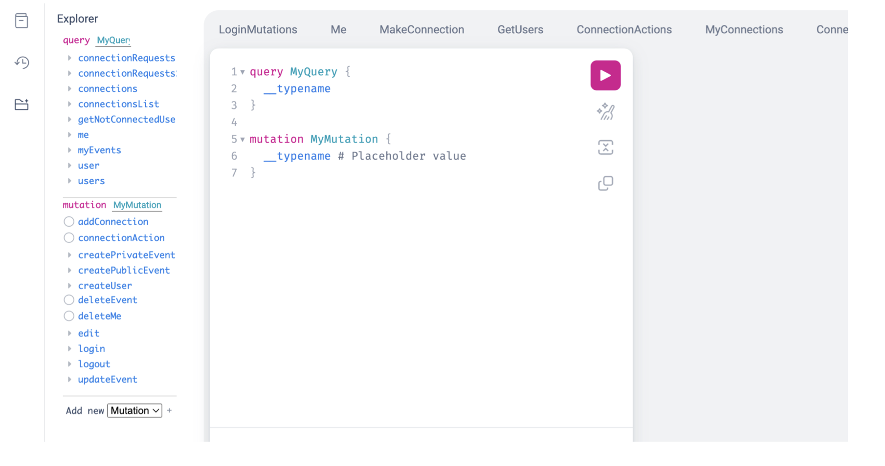

# Calendar Application Backend

A full-stack calendar application backend developed as part of the **Design Patterns** course and **Individual Project** at *Jagiellonian University, 2023*. This project showcases advanced design patterns inspired by *Martin Fowler* and integrates modern backend technologies.

This server supports the frontend available [here](https://github.com/KWaniova/CalendarOfEventsApp).

## Built With

- **Strawberry** - GraphQL library for Python ([Documentation](https://strawberry.rocks/docs))
- **SQLAlchemy** - ORM for database management
- **SQLite** - Lightweight relational database

## System Requirements

To run this application, you need a Python environment (Python 3.8.x or higher) with either `conda` or `pip` for package management.

### Setting Up the Python Virtual Environment

To create and activate a virtual environment, and install required packages:

```bash
python -m venv virtualenv
source virtualenv/bin/activate
pip install cryptography sqlalchemy 'fastapi[all]' 'uvicorn[standard]'
pip install 'strawberry-graphql[debug-server]'
```

## Starting the Server

To start the server in development mode, run:

```bash
uvicorn main:app --reload
```

This will launch the server with live reload enabled for development convenience.

## Api Documentation

GraphQL API documentation is available at `http://
localhost:8000/graphql`.


